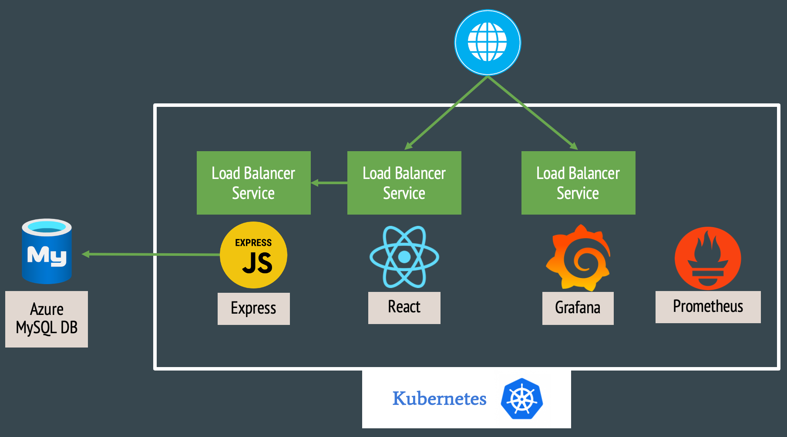
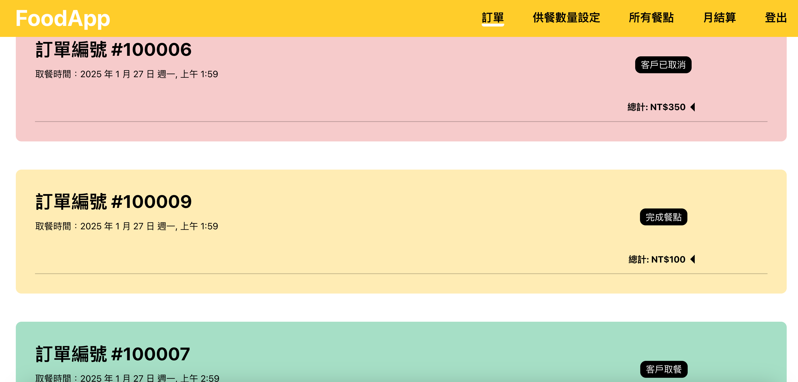
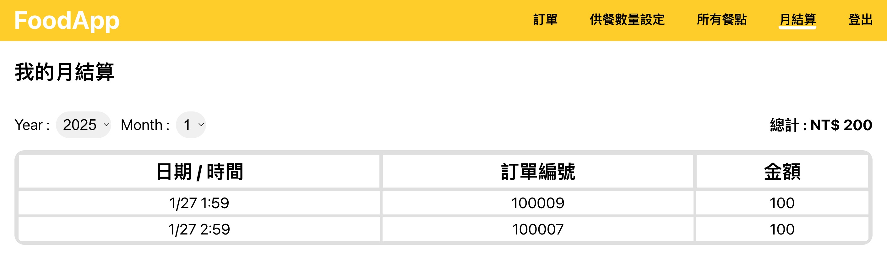
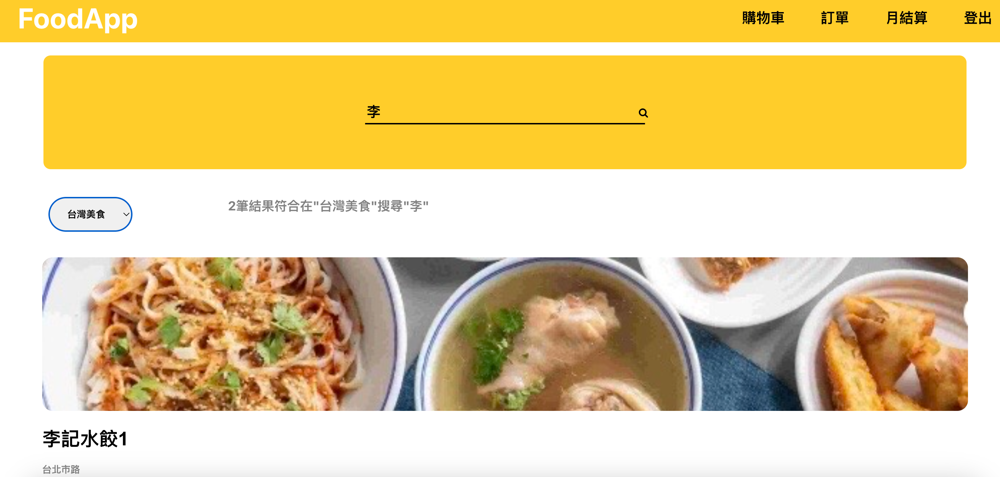
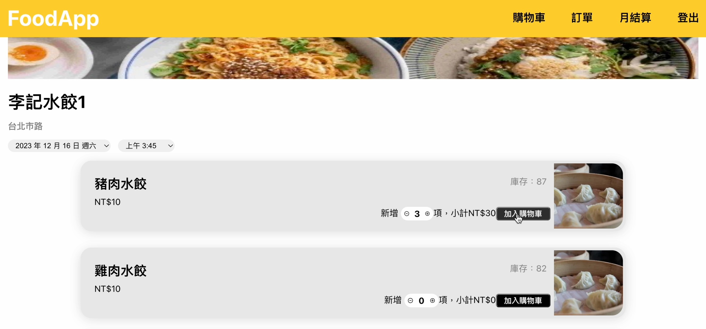
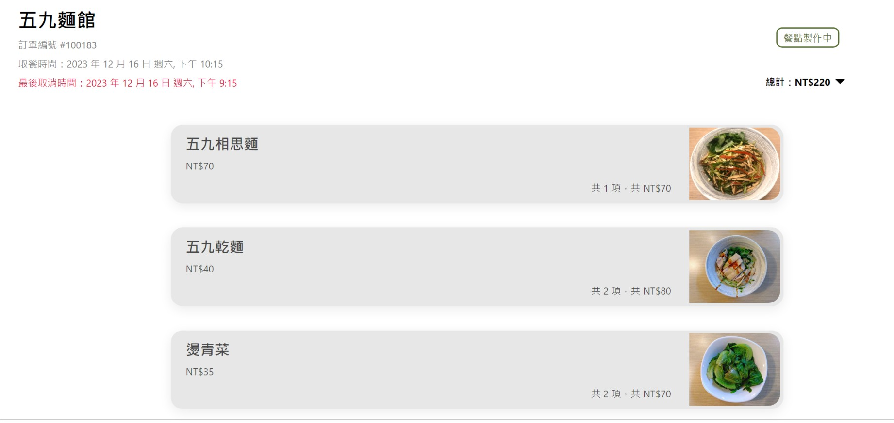
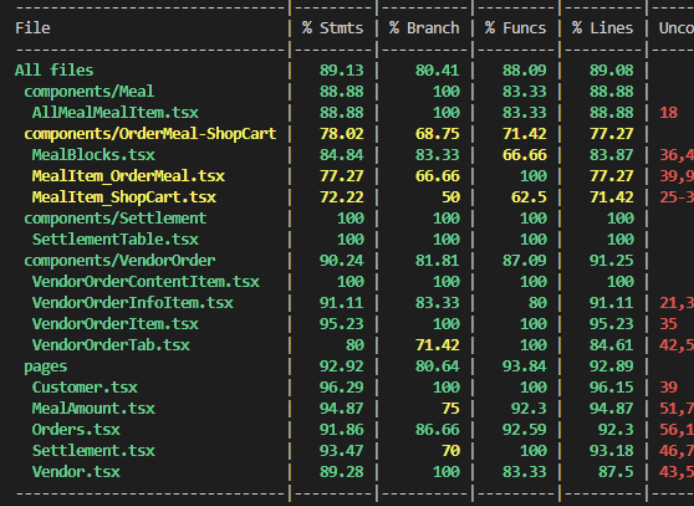

# Meal-Order
NTU CSIE 2023 Fall

## Introduction
Our app provides a platform built with React and Express, allowing consumers to order food and merchants to efficiently receive and prepare orders. We use MySQL for data management and integrate Prometheus and Grafana for monitoring system performance.

Deployed on Azure with Kubernetes, the app ensures high availability and scalability, while a load balancer distributes traffic evenly for optimal performance.




### Features for Vendor

#### Add Meals
Vendors can set the name, price, and quantity of meals.


#### Order Management
Easily manage orders with color-coded statuses:
Green: Order completed
Yellow: Order in progress
Red: Order canceled



#### Monthly Settlement
Generate monthly financial summaries for vendors.


### Features for Customer
#### Restaurant Search
Search for target restaurants by name or category.



#### Place Orders
After placing an order, customers will see the pickup time and the deadline for cancellations. Orders can be canceled before this deadline.




## Usage
### Application (Run Locally)
#### 1. Run MySQL Server & create `MEAL_ORDER` DB 

```bash
# When installing MySQL, set the root password
mysql -u root -p # Login with the root password
```

Type the following commands in MySQL console to create the database:
```sql
DROP DATABASE IF EXISTS MEAL_ORDER;
create database MEAL_ORDER;
use MEAL_ORDER;
DROP TABLE IF EXISTS Customer, Vendor, Meal, `Order`;

CREATE TABLE Customer (
    Customer_ID INT NOT NULL AUTO_INCREMENT PRIMARY KEY,
    Email VARCHAR(256) NOT NULL, 
    `Password` VARCHAR(30) NOT NULL, 
    `Name` VARCHAR(20) character SET utf8 NOT NULL, 
    UNIQUE(Email)
)ENGINE=INNODB;

CREATE TABLE Vendor (
    Vendor_ID INT NOT NULL AUTO_INCREMENT PRIMARY KEY,
    `Type` VARCHAR(30) character SET utf8 NOT NULL,
    `Name` VARCHAR(30) character SET utf8 NOT NULL,
    Address VARCHAR(30) character SET utf8 NOT NULL,
    Image_url VARCHAR(8192) character SET utf8,
    `Status` BOOL,
    Email VARCHAR(256) NOT NULL,
    `Password` VARCHAR(30) NOT NULL,
    UNIQUE(Email)
)ENGINE=INNODB;

CREATE TABLE Meal (
    Meal_ID INT NOT NULL AUTO_INCREMENT PRIMARY KEY,
    Vendor_ID INT NOT NULL,
    Meal_Name VARCHAR(512) character SET utf8 NOT NULL, 
    `Description` VARCHAR(512) character SET utf8,
    Price INT NOT NULL,
    Inventory json NOT NULL, 
    Image_url VARCHAR(8192) NOT NULL,
    Default_Inventory INT NOT NULL,
    FOREIGN KEY (Vendor_ID) REFERENCES Vendor (Vendor_ID) ON DELETE CASCADE
)ENGINE=INNODB;

CREATE TABLE  `Order` (
    Order_ID INT NOT NULL AUTO_INCREMENT PRIMARY KEY,
    Customer_ID INT NOT NULL,
    Vendor_ID INT NOT NULL,
     `Status` ENUM('IN_CART','WAIT_FOR_APPROVAL', 'PREPARING', 'READY_FOR_PICKUP', 'PICKED_UP', 'CANCELLED_UNCHECKED', 'CANCELLED_CHECKED') NOT NULL,
    Pickup_Time DATETIME NOT NULL,
    Meal_List JSON NOT NULL,
    Cash_Amount INT NOT NULL,
    FOREIGN KEY (Customer_ID) REFERENCES Customer (Customer_ID) ON DELETE CASCADE,
    FOREIGN KEY (Vendor_ID) REFERENCES Vendor (Vendor_ID) ON DELETE CASCADE
)ENGINE=INNODB;
```


#### 2. Run the Backend Server

> [!NOTE] 
> Place the `.env` file under the `backend` directory, and replace the values as needed.


```env
# backend/.env
PORT = "<port number>"

DB_HOST = "<db host url>"
DB_PORT = 3306
DB_USER = "<db user>"
DB_PASSWORD = "<db password>"
DB_DATABASE = "MEAL_ORDER"


MAIL_USER = "<gmail>"
MAIL_PASSWORD = "<gmail app password>"

AZURE_ACCOUNT="<azure account>"
AZURE_CONNECTIONSTRING="<azure connectionstring>"
AZURE_KEY="<azure key>"
AZURE_CONTAINER=image
AZURE_BLOB_SAS="<azure blob sas>"
```
Run the following commands:
```bash
cd backend
npm install -g nodemon # Install the nodemon package for monitoring the Express server
npm install # Install all the dependencies
node app.js # Run the application
```

#### 3. Run the Frontend Server

> [!NOTE] 
> Place the `.env` file under the `frontend2` directory, and replace the values as needed.


```env
# frontend2/.env
# REACT_APP_BACKEND_HOST example: http://localhost
REACT_APP_BACKEND_HOST="<backend host url>"
REACT_APP_BACKEND_PORT="<backend host port number>"
# REACT_APP_WS_HOST example: ws://localhost
REACT_APP_WS_HOST="<ws host url>"
REACT_APP_WS_PORT="<ws host port number>"
```

Run the following commands:
```bash
cd frontend2
npm install # Install all the dependencies
npm start # Run the application
```

---
### Application (Using AKS, Azure Kubernetes Service)
#### 1. Build docker images for frontend and backend and upload the images to Docker Hub.
```bash
# build backend image
cd backend
docker build -t meal-order-backend . --no-cache

# build frontend image
cd frontend2
docker build -t meal-order-frontend . --no-cache
```
#### 2. Set up mysql server on Azure manually.
#### 3. Create a resorce group `cloud-shell-storage-southeastasia` and k8s cluster `my-cluster`.
#### 4. Connect to the AKS cluster `my-cluster` in `cloud-shell-storage-southeastasia` by fetching its credentials and updating the local kubeconfig for kubectl access.
```bash
az aks get-credentials --resource-group cloud-shell-storage-southeastasia --name my-cluster
```
#### 5. Use Azure Container Registry (ACR) for managing images.
```bash
# create acr
az acr create --resource-group cloud-shell-storage-southeastasia --name mealorderimages --sku Basic

# import images to acr (pull from docker hub)
## frontend
az acr import \
  --name mealorderimages \
  --source docker.io/lyl1013/meal-order-frontend:latest \
  --image meal-order-frontend:latest

## backend
az acr import \
  --name mealorderimages \
  --source docker.io/lyl1013/meal-order-backend:latest \
  --image meal-order-backend:latest

# show acr images
az acr repository list --name mealorderimages --output table

# delete image
az acr repository delete --name mealorderimages --image <image name>

```
#### 6. Access ACR from the cluster.
```bash
# Case 1: If the ACR is in the same resource group as the cluster:
## Attach the ACR (mealorderimages) to the AKS cluster (my-cluster)
az aks update -n my-cluster -g cloud-shell-storage-southeastasia --attach-acr mealorderimages

## To validate whether the container registry is accessible from the AKS cluster, run the following az aks check-acr command:
az aks check-acr --resource-group cloud-shell-storage-southeastasia --name my-cluster --acr mealorderimages.azurecr.io

# Case 2: If the ACR is in a different resource group:
## Create a Kubernetes secret for accessing the ACR (mealorderimages)
kubectl create secret docker-registry acr-secret \
  --docker-server=mealorderimages.azurecr.io \
  --docker-username=mealorderimages \
  --docker-password=<acr-password> \
  --namespace=meal-order

## Modify the frontend-deployment.yaml file to use the secret
spec:
  containers:
  - name: your-container
    image: <acr-login-server>/your-image:tag
  imagePullSecrets:
  - name: acr-secret
```
#### 7. Upload the files in `Meal-Order/AKS_files/` to AKS and create `secret.yaml`
```yaml
# secret.yaml
apiVersion: v1
kind: Secret
metadata:
  name: mail-secret
type: Opaque
data:
  MAIL_PASSWORD: "<gmail app password>"

---
apiVersion: v1
kind: Secret
metadata:
  name: db-secret
type: Opaque
data:
  DB_PASSWORD: "<db password>"

---
apiVersion: v1
kind: Secret
metadata:
  name: blob-secret
type: Opaque
data:
  AZURE_KEY: "<azure key>"
  AZURE_CONNECTIONSTRING: "<azure connectionstring>"
  AZURE_BLOB_SAS: "<azure blob sas>"

```
#### 8. Run the application (required files are located in `Meal-Order/AKS_files/`).
```bash
# Run meal-order backend
kubectl create namespace meal-order
./run.sh

# Run meal-order frontend
kubectl create namespace meal-order
## Modify backend url in confimap.yaml and run it
./run2.sh
```
#### 9. Run Prometheus & Grafana
```bash
# 9-1. Case 1: the first time running the pods
helm repo add prometheus-community https://prometheus-community.github.io/helm-charts
helm repo update
helm install kube-prometheus-stack prometheus-community/kube-prometheus-stack --namespace monitoring --create-namespace

# 9-1. Case 2: re-run the pods
./run_monitor.sh
# After re-running the pods, follow the commands in run_monitor.sh

# 9-2. Change Grafana service to LoadBalancer
kubectl patch service kube-prometheus-stack-grafana -n monitoring --type='json' -p '[{"op":"replace","path":"/spec/type","value":"LoadBalancer"}]'
# Grafana username: admin, password: prom-operator
```
#### 10. Get logs of the application
```bash
# Method1: in cloud shell
kubectl get logs

# Method2: in Azure - Log Analysis
ContainerLogV2
| where PodNamespace == "meal-order" //update with target namespace
| project TimeGenerated, Computer, ContainerId, LogMessage, LogSource
```

---
### Monitoring the App 

> [!Note]
> You can skip step 1 & 2 if you are not running it the first time


#### Step 1：Download Prometheus and Grafana
* Use Brew to download
    ```bash
    brew install prometheus
    brew install grafana
    ```

#### Step 2：Adjust and Add Configuration File
* ```Grafana```: Since the default ```port``` for ```Grafana``` is ```3000``` and may cause conflicts, modify the configuration file (file path may vary).
    
    ```bash
    vim /opt/homebrew/etc/grafana/grafana.ini

    ;http_port = 3000 # Original, change to the following:
    http_port = 8080
    ```

* ```MySQL Exporter```: Create a ```.my.cnf``` file in the ```backend```folder to store account and password details.
    ```shell
    # my.cnf
    [client]
    host=mealorder26.mysql.database.azure.com
    port=3306
    user=<username>
    password=<password>
    ```

#### Step 3： Start Related Services in Order
1. Go to the ```backend``` folder

    ```bash
    cd backend
    ```

2. Open ```Prometheus```
    ```bash
    prometheus --config.file=prometheus_config.yml
    ```
    Note: If you encounter a situation where port 9090 is occupied after restarting, use the following commands to resolve the issue:

    ```bash
    lsof -i:9090 # If port 9090 is occupied, find the corresponding PID
    kill Pid_num # If the command above identifies the PID as 30103, then here, Pid_num = 30103.
    ```
3. Open ```MySQL Exporter```
    ```bash
    mysqld_exporter/mysqld_exporter --config.my-cnf=.my.cnf
    ```

4. Open ```Grafana```
    ```bash
    brew services start grafana # if first time
    brew services restart grafana #if not first time
    ```

#### Step 4：Grafana Setup (Skip if not the first time)

1. Open```http://localhost:8080```

2. Create **Conections**：Click the left sidebar menu => Connections => Search for "Prometheus" and click it => In the top-right corner, click Add new data source=>On the configuration page, enter ```http://localhost:9090``` in the Connection Block => 	Scroll to the bottom and click Save & Test
3. **Import Dashboard**: Click the left sidebar menu => DashBoard => Click New on the right side, then click Import =>Upload dashboard JSON File => Choose ```Dashboard.json```

#### Step 5：Open Dashboard
* Open **Dashboard**：Click the left sidebar menu => DashBoard =>  Click 「Self-Design Dashboard」


## Unit Test
- Use Jest to test the frontend
    - 
